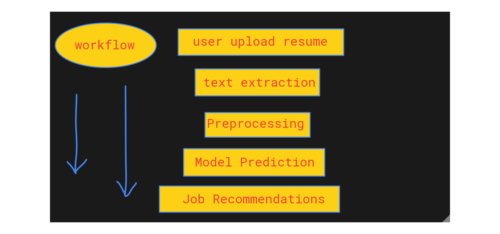

🚀 Resume Matcher — Job Recommendation based on you Resume
This is an end-to-end machine learning project that recommends suitable job roles based on a user's resume. The application is built using Flask for deployment and supports both PDF uploads and raw text input.

🧠 Features
Upload your resume as a PDF or paste it as plain text.
Automatically extracts and preprocesses resume content.
Recommends job titles using a machine learning model.
Lightweight and runs locally using Flask.
```
📁 Project Structure
├── app.py                  # Flask backend handling resume input and predictions
├── utils.py                # Utility functions: text preprocessing & recommendations
├── main.ipynb              # Jupyter Notebook: dataset creation, model training
├── model.pkl               # Trained machine learning model
├── dataset.pkl             # Preprocessed dataset used for training
├── templates/
│   └── index.html          # HTML frontend for file upload and results display
├── requirements.txt        # Python dependencies
├── .gitignore              # Standard ignore rules
└── README.md               # This file
```bash
```
🛠️ How It Works
User submits a resume (PDF or text).
The backend extracts and preprocesses the content.
A trained model predicts the most suitable job titles.
The recommendations are displayed on the web interface.

🚦 Sample Workflow


🧪 Running Locally
1. Clone the repository:
git clone https://github.com/gautamsingh04/ResumeMatcher
cd Resume_Matcher

2. Create a virtual environment and install dependencies:
python -m venv venv
source venv/bin/activate  # On Windows: venv\Scripts\activate
pip install -r requirements.txt

3. Run the application:
python app.py
Visit http://127.0.0.1:5000 in your browser.

📦 Dependencies
Gensim
scikit-learn
pandas
numpy
Regex
Flask
PyMuPDF (fitz)

💡 Future Improvements
Add user authentication and save history.
Use LLMs (e.g., GPT-based) for more context-aware recommendations.
